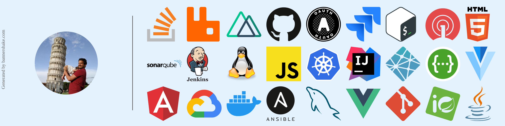
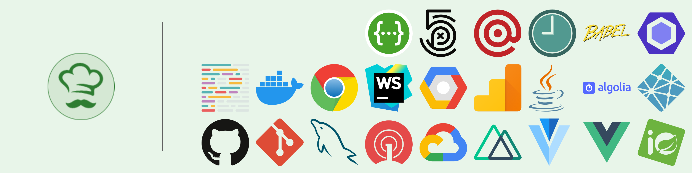

[](https://app.netlify.com/sites/bannershake/deploys)


# BannerShake

Full client side skills banner generator. Visit [https://bannershake.com](https://bannershake.com)

# Examples




## Logos

Logos are provided by [gilbarbara/logos](https://github.com/gilbarbara/logos) and optimized by [svg/svgo](https://github.com/svg/svgo). To import these logos : 

* First clone (or pull) [gilbarara's repo](https://github.com/gilbarbara/logos). This repo must be present at the same level as bannershake
* Then, install [go](https://golang.org/) to run the program and [svgo](https://www.npmjs.com/package/svgo) for optimizing SVG vector graphics files.
* Run the following commands : 
```
go run importLogos.go
npm run svgo
```